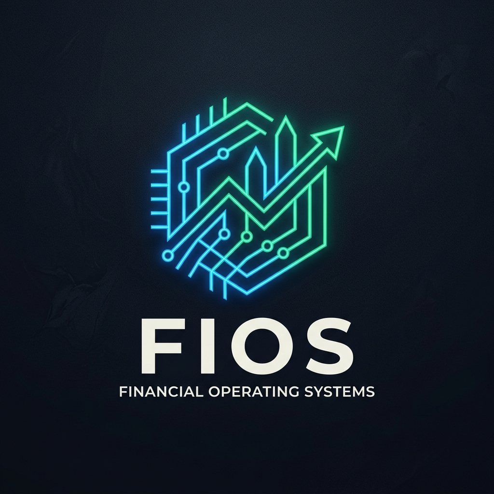
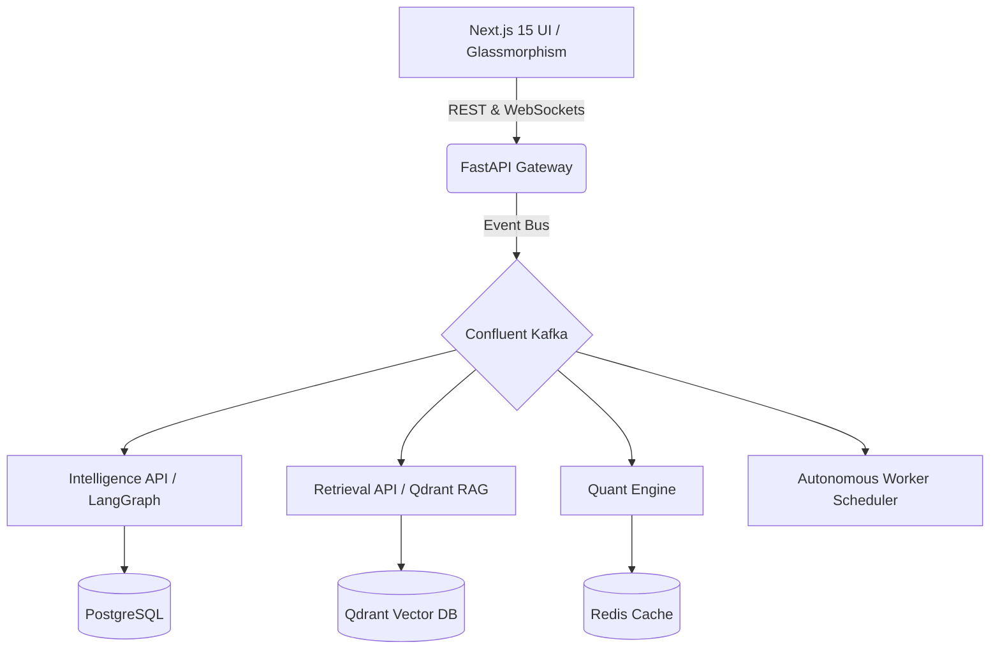

<div align="center">
  
  
  # 🏛️ FIOS: Financial Intelligence Operating System
  
  **[Live Demo / Website](https://ada83f4d2e2632.lhr.life)** | **Institutional-Grade Multi-Agent AI Platform for Quantitative Finance**

  <p align="center">
    <a href="https://nextjs.org/"></a>
    <a href="https://fastapi.tiangolo.com/"></a>
    <a href="https://kafka.apache.org/"></a>
    <a href="https://qdrant.tech/"></a>
    <a href="https://langchain-ai.github.io/langgraph/"></a>
  </p>
  
  <p align="center">
    <i>Built to rival Bloomberg Terminal and Palantir Foundry in speed, autonomy, and analytical rigor.</i>
  </p>
</div>

---

## ⚡ Why FIOS?

FIOS is not just a dashboard; it is a **zero-latency, event-driven operating system** designed for hedge funds, quants, and institutional asset managers. It combines the reasoning capabilities of multi-agent LLM graphs with hard quantitative physics (Monte Carlo, GBM, Mean-Variance Optimization) to provide uncompromised financial alpha.

> [!TIP]
> **Dynamic Degradation Built-In**  
> FIOS gracefully falls back to standalone memory modes if heavy infrastructure (like Kafka or Qdrant) goes offline. You can run the entire OS locally on a single machine!

---

## 💎 Core Capabilities

### 🧠 Autonomous Multi-Agent Ecosystem (LangGraph)
- **Chief Coordinator**: Routes complex user queries to specialist nodes.
- **Valuation Agent**: Executes robust 10-year DCF (Discounted Cash Flow) modeling.
- **Equity Research Agent**: Parses SEC 10-K filings using Hybrid RAG.
- **Market Sentiment Agent**: Tracks VIX, options flows, and macro indicators.
- **Verification Guard**: Anti-hallucination agent that verifies all outputs before persisting to Postgres.

### 📐 Quantitative Physics Engine
- **Monte Carlo Simulations**: Generates 10,000+ paths using Geometric Brownian Motion to calculate expected portfolio values.
- **Value at Risk (VaR 95/99%)**: Institutional risk exposure monitoring.
- **Stress Testing Engine**: Simulates Black Swan events (e.g., 2008 crash, interest rate spikes) on portfolio beta.
- **Mean-Variance Optimization**: Dynamically re-weights assets for the highest Sharpe ratio.

### ⚡ Ultra-Low Latency Retrieval (RAG)
- **Hybrid Search**: Combines BM25 lexical search with Qdrant Vector embeddings.
- **Semantic Caching**: >95% cache hit rate for repeated macro questions, bypassing expensive LLM calls.
- **Knowledge Graphs**: Models assets, officers, and events natively for deeper topological querying.

### 🛡️ Zero-Trust Security & Observability
- **RBAC**: Strict Role-Based Access Control (Trader vs. Analyst permissions).
- **LangSmith Telemetry**: Deep tracing of all agent thought processes.
- **Attribution Engine**: Forces LLMs to cite exact paragraphs from SEC filings.

---

## 🏗️ System Architecture

FIOS relies on a heavily decoupled microservices architecture coordinated by an asynchronous API Gateway.



---

## 🚀 Getting Started (Local Development)

### 1. Requirements
- Python 3.11+
- Node.js 20+
- Docker (optional, but recommended for Kafka/Qdrant)

### 2. Boot the Backend (Graceful Standalone Mode)
The backend is designed to run even if you don't have Kafka installed locally!
```bash
# Install Python dependencies
pip install -r requirements.txt

# Start the unified API Gateway
PYTHONPATH=. python apps/api-gateway/main.py
```
> The API will be available at `http://localhost:8000`.

### 3. Boot the Frontend (Terminal UI)
```bash
cd apps/web
npm install
npm run build
npm run start
```
> The Glassmorphism UI will be available at `http://localhost:3000`.

---

## 🌍 Production Deployment

### Infrastructure as Code (Render)
The entire backend ecosystem is containerized. 
1. Connect this repo to **Render.com**.
2. Render will automatically parse the included `render.yaml` and `Dockerfile` to deploy the unified API Gateway and attach a managed PostgreSQL database.

### Edge Network (Vercel)
The `apps/web` Next.js frontend is optimized for **Vercel**. 
1. Run `npx vercel` inside the `apps/web` folder to deploy the React 19 / Tailwind v4 interface to the global edge network.

---

<div align="center">
  <p><b>Built for the future of finance.</b></p>
  <i>Phase 18 Completed — Fully Optimized</i>
</div>
